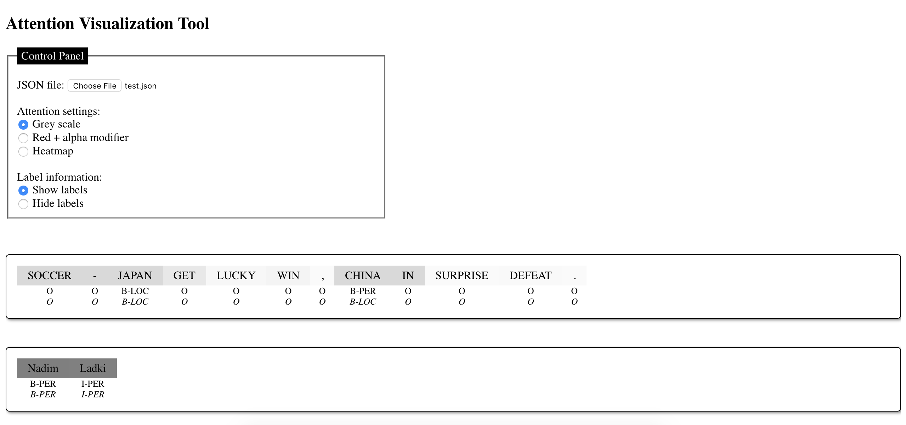

# Deep Visualization Tools

Basic tools to visualize different aspects of deep learning such as attention weights. 

_**NOTE**: this is work in progress, and basically, tools are built and uploaded when needed._

### Self-Attention Visualizer

The repo has a sequential attention visualizer that uses a JSON as input. Here's an example:

### Multi-head Self-attention Visualizer

TBD